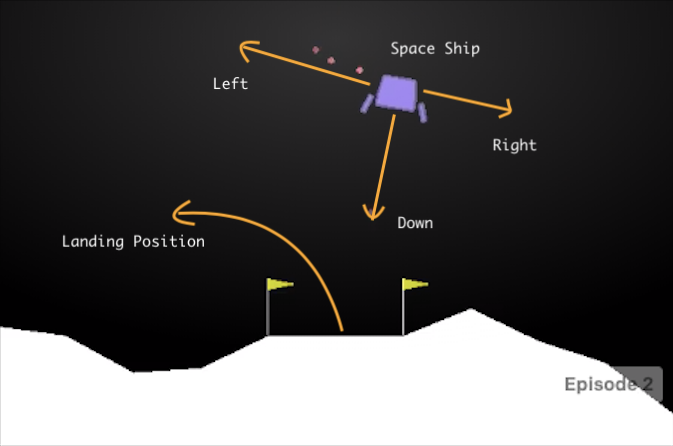
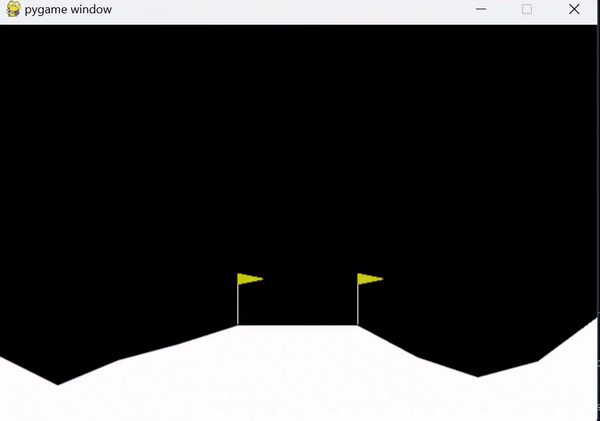

# Introduction to Reinforcement Learning with Lunar Lander

**Reinforcement Learning (RL)** is a fascinating subset of machine learning where an agent learns to make optimal decisions by interacting with its environment to maximize **cumulative rewards**. <br>Imagine training a dog to perform tricks: each time the dog successfully performs a trick, you reward it with a treat. Over time, the dog learns to associate the trick with the reward and performs it more frequently. This simple yet powerful concept is the foundation of reinforcement learning.

In this tutorial, we will embark on an exciting journey to teach an **AI agent** how to land on the moon. We will achieve this by setting up an environment using **Stable Baselines 3** and **OpenAI Gymnasium** to run the Lunar Lander simulation. Along the way, we will delve into essential RL concepts such as action space, observation space, and the **Proximal Policy Optimization (PPO)** algorithm.


## Contents
- [Understanding the Lunar Lander Environment](#Understanding-the-Lunar-Lander-Environment)
- [How is RL Trained](#How-is-an-RL-Agent-Trained)
- [Setting up Lunar Lander Environment](#Setting-up-Lunar-Lander-Environment)
- [Conclusion](#Conclusion)


## Understanding the Lunar Lander Environment

The Lunar Lander environment is a classic control problem where the goal is to land a lunar module safely on the moon's surface. The environment provides a simulation where the agent (the lunar module) can perform actions to control its movement.



### Action Space

The action space defines the set of all possible actions that the agent can take at any given time. In the Lunar Lander environment, the action space is discrete with four possible actions:

- `0`: Do nothing<br>
- `1`: Fire left orientation engine
- `2`: Fire main engine
- `3`: Fire right orientation engine

### Observation Space

The observation space defines the set of all possible states that the environment can be in. In the Lunar Lander environment, the observation space is a continuous space consisting of 8 variables:

1. X position
2. Y position
3. X velocity
4. Y velocity
5. Angle
6. Angular velocity
7. Left leg contact
8. Right leg contact

### Reward Structure

After every step (or you can say, a frame) a reward is granted. The total reward of an episode is the sum of the rewards for all the steps within that episode.

For each step, the reward:

- is increased/decreased the closer/further the lander is to the landing pad.
- is increased/decreased the slower/faster the lander is moving.
- is decreased the more the lander is tilted (angle not horizontal).
- is increased by 10 points for each leg that is in contact with the ground.
- is decreased by 0.03 points each frame a side engine is firing.
- is decreased by 0.3 points each frame the main engine is firing.

The episode receive an additional reward of -100 or +100 points for crashing or landing safely respectively.

An episode is considered a solution if it scores at least 200 points.

### Starting State

The lander starts at the top center of the viewport with a random initial force applied to its center of mass.

### Episode Termination
The episode finishes if:

- the lander crashes (the lander body gets in contact with the moon);
- the lander gets outside of the viewport (x coordinate is greater than 1);
- the lander is not awake. A body which is not awake is a body which doesn’t move and doesn’t collide with any other body:

## How is an RL Agent Trained?

In this tutorial, we will use the Proximal Policy Optimization (PPO) algorithm to train our reinforcement learning agent. PPO is a popular and effective algorithm in the field of reinforcement learning due to its balance between simplicity and performance.

### Proximal Policy Optimization (PPO) Algorithm

Proximal Policy Optimization, or PPO, is a method used in reinforcement learning to help an AI agent learn the best actions to take. It works by:

1. Learning from Experience: The agent tries different actions and learns from the results.
2. Balanced Approach: It balances exploring new actions and exploiting known good actions.
3. Careful Updates: PPO makes small, careful updates to the agent’s strategy to keep learning stable.
4. Clipping for Stability: It limits how much the strategy can change at once, preventing big, disruptive updates.
5. In short, PPO helps the agent learn effectively by making steady and stable improvements.

## Setting up Lunar Lander Environment

Now that we understand what Reinforcement Learning is, how the Proximal Policy Optimization (PPO) algorithm works, and the specifics of the Lunar Lander environment, it's time to set up the environment and train our agent to land on the moon.

### Step 0: Setting up Virtual Environment
Before we start, we need to create a virtual environemt and activate it.
```bash
python -m venv lunar-lander
```
- Note that the name of the virtual environment is `lunar-lander`. You can choose any name you like.

Activate the Environment:
```bash
.\lunar-lander\Scripts\activate
```

### Step 1: Installing Necessary Libraries
First, ensure you have the necessary libraries installed. Open your terminal and run:
```bash
pip install stable-baselines3 gymnasium[box2d] numpy==1.26.4
```

### Step 2: Importing Libraries
Next, we will import the required libraries in out Python script
```python
import gymnasium as gym
from stable_baselines3 import PPO
```

### Step 3: Create the Lunar Lander Environment
We'll create an instance of the Lunar Lander environment using OpenAI Gymnasium.
```python
env = gym.make("LunarLander-v2")
```

### Step 4: Initialize the PPO Model
Initialize the PPO model with the environment. This model will be used to train our agent.
```python
model = PPO("MlpPolicy", env, verbose=1)
```
- Here `verbose=1` will display the training logs.

### Step 5: Train the PPO Model
Now, let's train the PPO model. This step can take some time depending on your computer's performance:
```python
model.learn(total_timesteps=1000000)
```
- The `total_timesteps` parameter specifies the total number of timesteps the model will be trained for. You can increase or decrease this value based on your requirements.

### Step 6: Save the trained model
After training, it's a good practice to save the trained model so you can load it later without retraining:
```python
model.save("ppo-lunar-lander")
```
To load the model, you can use:
```python
model = PPO.load("ppo-lunar-lander")
```

### Step 7: Evaluate the Model
Evaluate the performance of the trained model by running a few episodes and observing the total rewards:
(More the Reward, better the performance)
```python
episodes = 10
for episode in range(episodes):
    obs, info = env.reset()
    done = False
    total_reward = 0
    
    while not done:
        action, _states = model.predict(obs)
        obs, reward, done, info, truncated = env.step(action)
        total_reward += reward
    
    print(f"Episode: {episode + 1}, Total Reward: {total_reward}")

env.close()
```

### Step 8: Render the Environment
Finally, let's render the environment to visually observe how the agent performs:
For this, create a new Python file.

1. Add required libraries.
```python
import gymnasium as gym
from stable_baselines3 import PPO
```
2.  Initialize the environment
```python
env = gym.make("LunarLander-v2", render_mode="human")
```
- here `render_mode="human"` will render the environment in a seperate window for us to view.
3. Load the trained model
```python
model = PPO.load("ppo_lunar_lander")
```
4. Run the environment
```python
obs, info = env.reset()
done = False

while not done:
    action, _states = model.predict(obs)
    obs, reward, done, info, truncated = env.step(action)
    env.render()

env.close()
```


## Conclusion
In conclusion, we have explored the fascinating world of Reinforcement Learning (RL) and its application in training an AI agent to land on the moon using the Lunar Lander environment. We have learned about essential RL concepts such as action space, observation space, and the Proximal Policy Optimization (PPO) algorithm.

By following the step-by-step guide, you can set up the Lunar Lander environment, train the PPO model, save and load the trained model, evaluate its performance, and even render the environment for visual observation.

But the fun doesn't stop here! OpenAI Gymnasium provides a wide range of environments for you to explore and experiment with. You can visit the [OpenAI Gymnasium website](https://gym.openai.com/) to discover other exciting environments and try out different algorithms to solve various RL problems.

I hope this tutorial has sparked your curiosity and inspired you to dive deeper into the world of RL. Happy coding and happy exploring!
